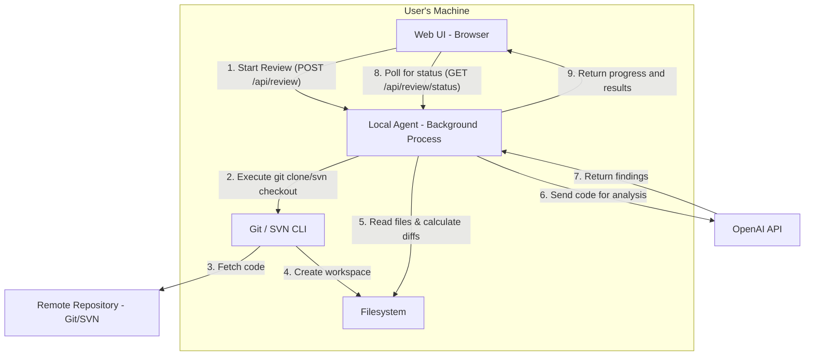
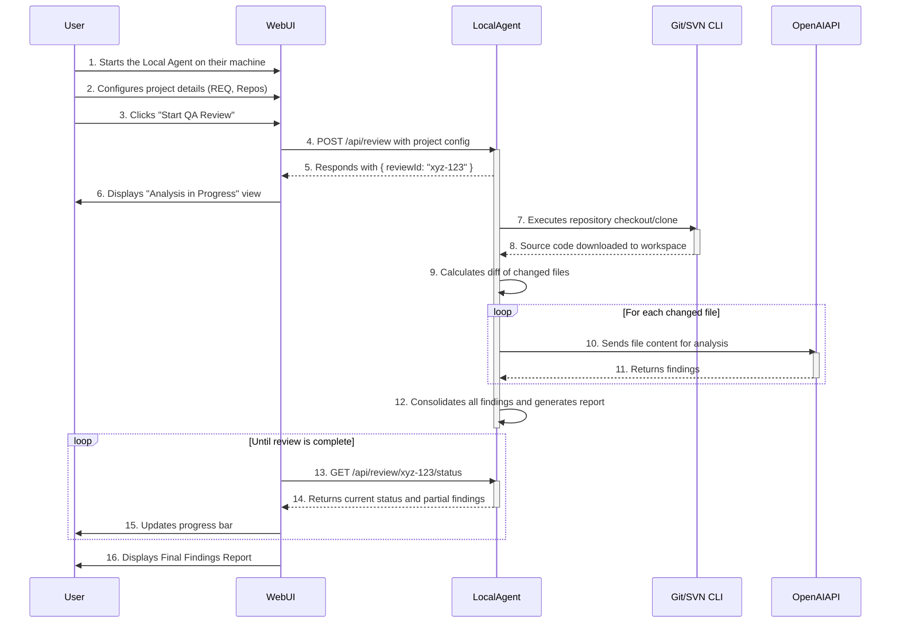
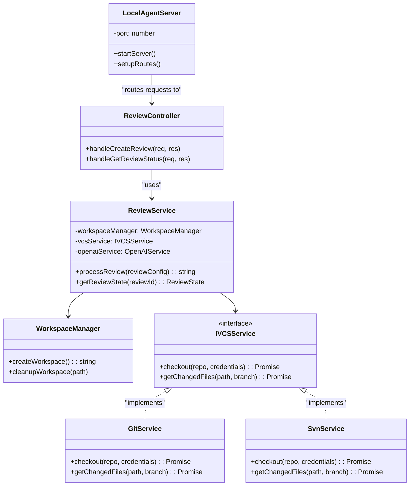

# Specification: AI-Powered QA Review Pipeline with Local Agent

## 1. Executive Summary

This document defines the architecture and requirements for migrating the "AI-Powered QA Review Pipeline" from a purely web-based application to a hybrid model. This new model will consist of the existing **Web UI (Client)** and a new **Local Desktop Agent (Server)**.

The primary goal is to overcome browser sandbox limitations, enabling the application to perform local operations such as cloning Git/SVN repositories, managing a temporary workspace on the local filesystem, and executing code analysis directly on the user's machine.
## 2. System Architecture

The system will be composed of two main components communicating via a local REST API.

1.  **Web UI (Client):** The existing React application. It will be responsible for presentation, user interaction, and communicating with the Local Agent. It will not handle heavy business logic.

2.  **Local Agent (Server):** A lightweight server application running in the background on the user's machine. It will be responsible for all backend operations:

    *   Interacting with version control systems (Git, SVN).
    *   Managing a temporary workspace on the local filesystem.
    *   Calculating file diffs.
    *   Communicating with the OpenAI API for code analysis.
    *   Exposing a secure REST API on `localhost` for the Web UI to consume.
### Component Architecture Diagram
 



## 3. Use Cases

### Use Case 1: Perform a Full QA Review
 
*   **Actor:** QA Engineer.
*   **Description:** The user configures and runs a QA review for one or more private Git/SVN repositories, receiving a report of findings based on a real analysis of the files.
*   **Main Flow (Sequence Diagram):**




## 4. Functional Requirements

### RF-AGENT-01: Workspace Management
*   The Agent must create a unique, temporary workspace directory for each review process.
*   The Agent must clean up (delete) the temporary workspace after the review is completed or has failed.
### RF-AGENT-02: Version Control Interaction
*   The Agent must be able to execute `git` commands to clone repositories and get diffs between branches.
*   The Agent must be able to execute `svn` commands to check out repositories and get diffs.
*   The Agent must securely handle credentials to authenticate with private repositories (credentials are passed per-request and never stored on disk by the agent).

### RF-AGENT-03: Local REST API
*   The Agent must run an HTTP server that listens exclusively on `localhost` on a configurable port.
*   The Agent must expose, at a minimum, the endpoints defined in the "API Contract" section.

### RF-AGENT-04: Analysis Orchestration
*   The Agent will receive a review configuration, manage the entire workflow (checkout, diff, analysis), and store the results in memory until they are retrieved.

### RF-UI-01: Agent Communication and Detection
*   The Web UI must detect if the Local Agent is running (e.g., via a `/ping` endpoint).
*   If the agent is not running, the UI must display clear instructions for the user on how to download and run it.
*   All file-fetching logic (`repositoryService`) must be refactored to call the Local Agent's API instead of the GitHub API or simulations.

## 5. Non-Functional Requirements
*   **RNF-01 (Security):** Communication between the UI and the Agent must be strictly on `localhost`. The Agent must not expose itself to the local network. Credentials must not be stored in logs or on disk.
*   **RNF-02 (Compatibility):** The Local Agent must be compatible with major operating systems: Windows, macOS, and Linux.
*   **RNF-03 (Usability):** The process for downloading and running the agent must be simple and well-documented within the UI.
## 6. Class Diagram (Conceptual for Local Agent)
This diagram models the main components within the Local Agent.



  

## 7. API Contract (Local Agent)

### `GET /ping`
*   **Description:** Checks if the agent is running.
*   **Success Response (200 OK):**
    ```json

    { "status": "ok", "version": "1.0.0" }

    ```

### `POST /api/review`
*   **Description:** Starts a new, asynchronous QA review.
*   **Request Body:**

    ```json
    {
      "project": {
        "reqId": "102546",
        "screen": "PAR_NOVPASOSDES",
        "repositories": [
          {
            "type": "GIT",
            "url": "https://dev.azure.com/...",
            "branch": "feature/104095"
          }
        ],
        "rules": [...]
      },
      "secrets": [
          {
              "name": "AZURE_DEVOPS_TOKEN",
              "value": "...",
              "username": "..."
          }
      ]
    }
    ```

*   **Success Response (202 Accepted):**

    ```json

    { "reviewId": "uuid-generated-by-agent" }

    ```

  

### `GET /api/review/{reviewId}/status`

*   **Description:** Polls for the status of an ongoing review.

*   **Success Response (200 OK):**

    ```json
    {
      "reviewId": "uuid-generated-by-agent",
      "status": "analyzing", // "pending", "cloning", "diffing", "analyzing", "completed", "error"
      "progress": {
        "totalFiles": 10,
        "processedFiles": 3,
        "currentFile": "services/UserService.cs"
      },
      "findings": [...], // Array of findings discovered so far
      "error": null // Or an error message string if status is "error"
    }
    ```